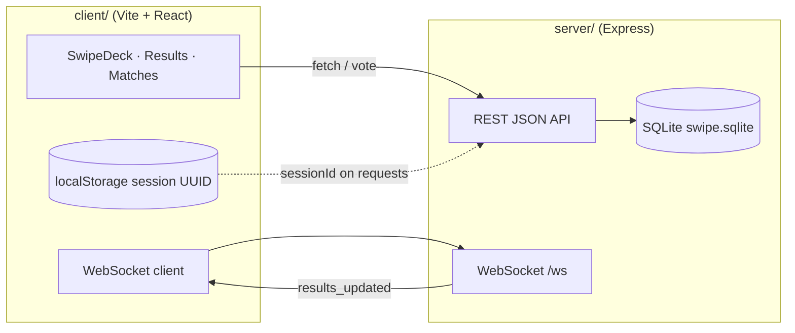

# Landmark Swipe — Swipe-to-Vote (Mobile Web)

A mobile-first swipe voting app: users rate **110 hypothetical landmark trips** (yes/no). Votes persist in **SQLite** on the server so **Results** reflect aggregates across all sessions. The UI targets a **390×844** viewport; mouse drag works on desktop for demos and grading.

**Voting theme:** *“Would you book a trip here tomorrow?”* — each card shows a label, short description, and placeholder photo ([Lorem Picsum](https://picsum.photos/)).

---

## Repository layout

| Path | Role |
|------|------|
| `client/` | React 18 + Vite + TypeScript UI (gestures, tabs, WebSocket client) |
| `server/` | Express API, `node:sqlite` persistence, seed/admin scripts |
| `package.json` | npm workspaces root (`npm run dev` runs both apps) |
| `AI_NOTES.md` | Required AI collaboration write-up (Section 6) |

---

## How to install and run

### Prerequisites

- **Node.js ≥ 22.12** — uses the built-in [`node:sqlite`](https://nodejs.org/api/sqlite.html) module (no native SQLite compile step).
- **Network access** for card images (`picsum.photos`).

### Steps (fresh clone)

```bash
# 1. Install dependencies (root + workspaces)
npm install

# 2. Create the database and seed 110 items
npm run seed

# 3. Start API + client together
npm run dev
```

| Service | URL |
|---------|-----|
| API | http://localhost:3333 |
| Web UI (Vite) | http://localhost:5173 |

Open the UI in a mobile-sized window or device emulator for the intended layout.

### Optional configuration

Copy `client/.env.example` to `client/.env.local` if the API is not on port 3333:

```bash
# client/.env.local
VITE_API_URL=http://localhost:3333
```

Override the database file path when seeding or running the API:

```bash
SWIPE_DB_PATH=/path/to/custom.sqlite npm run seed
```

### Production build

```bash
npm run build          # client → client/dist, server → server/dist
npm run start -w server   # API only (serve client/dist via any static host, or use Vite preview)
```

### Troubleshooting

| Issue | Fix |
|-------|-----|
| **`EADDRINUSE` on port 3333** | Stop the stray process, or run `PORT=3340 npm run dev -w server` and set `VITE_API_URL=http://localhost:3340` in `client/.env.local`. |
| **Empty deck / no items** | Run `npm run seed` (creates `server/data/swipe.sqlite`). |
| **Broken images** | Requires internet; images are remote Picsum URLs, not bundled assets. |
| **Reset all votes** | `rm -f server/data/swipe.sqlite*` then `npm run seed`. |

### Admin scripts

```bash
npm run seed                    # 110 themed items
npm run add-item -- --id my-id --label "Label" --image "https://..." --desc "optional"
```

---

## Architecture



**Client (`client/`)**

- **Swipe tab:** `@use-gesture/react` + `@react-spring/web` for drag, tilt, green/red overlays, threshold rail, and fly-out on commit; Yes/No buttons use the same animation path.
- **Results tab:** global aggregates from `GET /results`; sort modes and text filter; optional pull-down gesture from Swipe navigates here.
- **Matches tab:** items the user voted **yes** on where global yes-rate ≥ adjustable threshold (`GET /matches`).
- **Session:** anonymous UUID in `localStorage`; `GET /my-votes` restores progress after reload.
- **Live updates:** WebSocket subscribes to `results_updated` and refetches aggregates (shows a “Live” indicator when connected).

**Server (`server/`)**

- **Express** JSON API with CORS enabled for local dev.
- **SQLite** file at `server/data/swipe.sqlite` (WAL mode). Schema: `items`, `votes`, `sessions_meta`.
- **Vote idempotency:** composite primary key `(session_id, item_id)` with `INSERT … ON CONFLICT DO UPDATE` — **latest vote wins** per session per item.
- **WebSocket** broadcasts after each vote or undo so connected clients refresh Results without polling.

**Persistence choice:** SQLite via `node:sqlite` keeps deployment simple (single file, no Docker DB). Trade-off: the API is still marked **experimental** in Node; fine for this workload, not aimed at high write concurrency.

---

## Completed requirements

### Core (Section 3.1)

| # | Requirement | Status | Notes |
|---|-------------|--------|-------|
| 1 | Documented voting theme | ✅ | See [Voting theme](#landmark-swipe--swipe-to-vote-mobile-web) and in-app copy |
| 2 | ≥100 items (image + label + description) | ✅ | **110** rows from `server/seed.ts` |
| 3 | Swipe right = yes, left = no; Yes/No buttons | ✅ | `SwipeCard.tsx` |
| 4 | Visual feedback (tilt, color, threshold, smooth next card) | ✅ | Spring animations + threshold shuttle |
| 5 | Results: pull-down **or** tab; global aggregates | ✅ | `ResultsPanel.tsx` + pull-down on Swipe |
| 6 | Sort/filter on results | ✅ | Sort: most-loved, most-no, most-divisive, most-skipped; text filter |
| 7 | Backend persistence (not `localStorage` as source of truth) | ✅ | SQLite; `localStorage` only stores `sessionId` |
| 8 | End-of-deck state | ✅ | Shown when all items voted in session |
| 9 | `GET /items`, `POST /vote`, `GET /results` | ✅ | See [API](#api-reference) |
| 10 | Idempotent vote per user/item | ✅ | PK + upsert; documented below |
| 11 | Server-side input validation | ✅ | `server/src/validation.ts` |
| 12 | README: install, architecture, requirements, issues | ✅ | This file |

**Vote de-duplication (required behavior):** For each `(session_id, item_id)` there is at most one row in `votes`. Re-posting replaces the previous choice instead of double-counting.

### Stretch (Section 3.2)

| # | Feature | Status | Implementation |
|---|---------|--------|----------------|
| 7 | Session identity | ✅ | UUID in `localStorage`; `GET /my-votes` |
| 8 | Undo | ✅ | `POST /vote/undo` + UI stack |
| 9 | Matches view | ✅ | `GET /matches` + threshold slider |
| 10 | Real-time aggregates | ✅ | WebSocket `results_updated` on `/ws` |
| 11 | Admin seed script | ✅ | `npm run seed`, `npm run add-item` |
| 12 | Basic analytics | ✅ | `GET /analytics` + footer strip |

**All listed stretch goals are implemented.**

---

## API reference

| Method | Path | Purpose |
|--------|------|---------|
| `GET` | `/items` | All votable items |
| `POST` | `/vote` | Body: `{ itemId, choice: "yes"\|"no", sessionId }` — optional `decisionMs` |
| `GET` | `/results` | Per-item yes/no counts (all users) |
| `GET` | `/my-votes?sessionId=` | Current session’s votes (resume after reload) |
| `POST` | `/vote/undo` | Body: `{ sessionId, itemId }` |
| `GET` | `/matches?sessionId=&threshold=` | User’s yes-votes where global yes-rate ≥ threshold |
| `GET` | `/analytics` | Totals: votes, sessions, avg decision time |
| `GET` | `/health` | Liveness check |
| WebSocket | `/ws` | Push `results_updated` after vote/undo |

---

## Known issues and limitations

- **Node experimental warning** — `node:sqlite` may log `ExperimentalWarning` at startup; expected until the API is stable.
- **No authentication** — `sessionId` is client-generated and trusted by the API (acceptable for anonymous classroom use; not suitable for adversarial production traffic).
- **Remote images only** — cards depend on `picsum.photos`; offline or blocked networks show broken images.
- **Undo scope** — undo stack lives in browser memory for the current page session; a full reload clears the stack (server votes remain until explicitly undone again).
- **Undo is per-item** — only the last undone item is removed server-side per request; rapid undo requires multiple actions.
- **Concurrent load** — WAL mode handles light parallel writes; not load-tested for heavy traffic.

---

## AI usage (Section 6)

A separate collaboration write-up is in **[`AI_NOTES.md`](./AI_NOTES.md)** (required by the brief).


